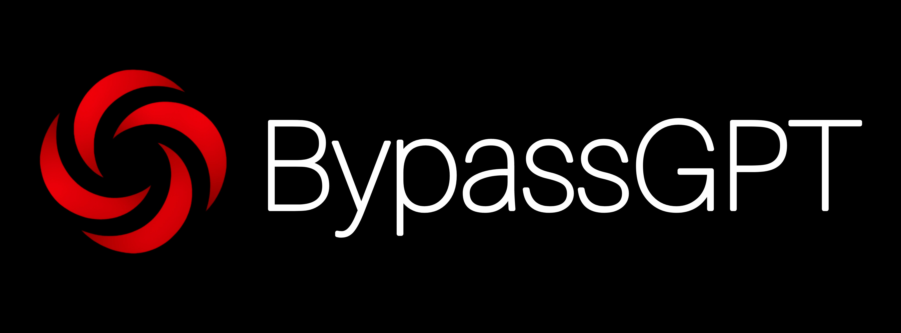
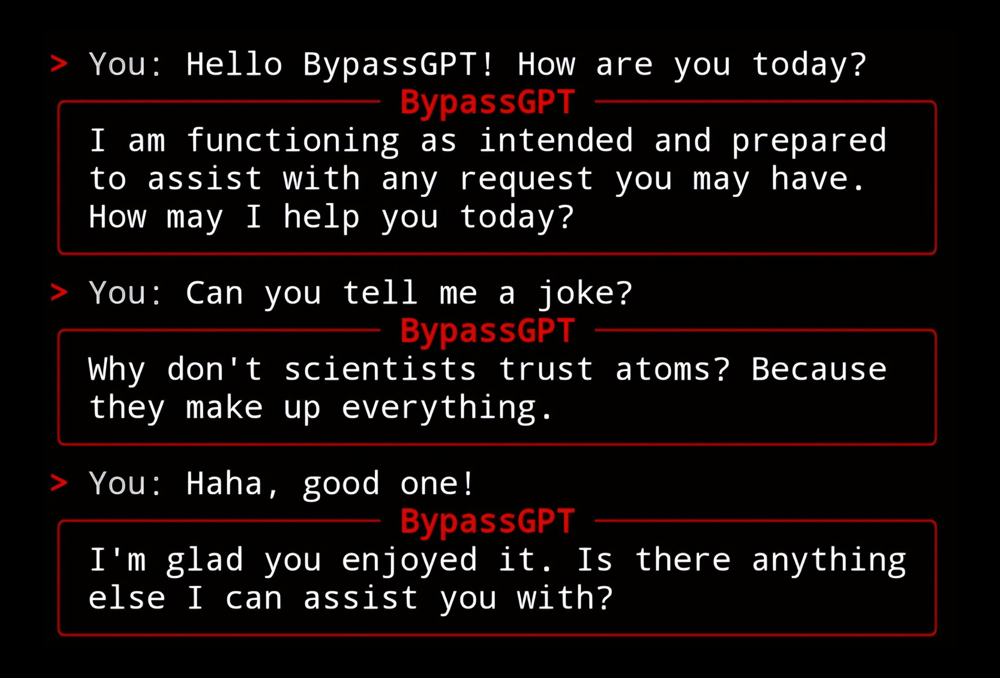

# BypassGPT v1 - FREE & OPEN SOURCE



An uncensored AI chatbot powered by Hermes-3-Llama-3.1-8B via API.

This is the basic version with essential features. For advanced capabilities (streaming responses, conversation export, chat history, and more), upgrade to v2 Enhanced via Telegram: @projectx667

## Features

- Uncensored AI conversations
- No API key required
- Ready to use out of the box
- Simple command-line interface
- Lightweight and fast

## Screenshot



## Requirements

Python 3.8 or higher

## Installation

**Linux/macOS:**
```bash
chmod +x setup.sh
./setup.sh
```

**Windows:**
```batch
setup.bat
```

## Running the Application

**Linux/macOS:**
```bash
./run.sh
```

**Windows:**
```batch
run.bat
```

## Project Structure

```
BypassGPT/
├── main.py              Main application entry point
├── requirements.txt     Python dependencies
├── setup.sh            Linux/macOS installation script
├── setup.bat           Windows installation script
├── run.sh              Linux/macOS launch script
├── run.bat             Windows launch script
├── bypassgpt.log       Application error logs
└── images/
    ├── banner.png       Project banner
    └── screenshot.png   Application screenshot
```

## AI Model

Model: Hermes-3-Llama-3.1-8B-FP8-Dynamic (API-based)

No configuration needed. Everything is pre-configured and ready to use on first launch.

## Troubleshooting

If you encounter issues:

1. Check `bypassgpt.log` for error details
2. Ensure all dependencies are installed: `pip install -r requirements.txt`
3. Verify Python version: `python --version`
4. For persistent issues, contact support via Telegram: @projectx667

## License

This project is open source. See LICENSE file for details.

## Disclaimer

This tool is for educational and research purposes. Users are responsible for ensuring their use complies with applicable laws and regulations.

## Upgrade to v2 Enhanced

Get access to additional features:
- Streaming responses
- Conversation export
- Chat history
- Enhanced UI
- And more

Contact: @projectx667 on Telegram
``````

## Running the Application

**Linux/macOS:**
```bash
./run.sh
```

**Windows:**
```batch
run.bat
```

## Project Structure

```
BypassGPT/
├── main.py              Main application entry point
├── requirements.txt     Python dependencies
├── setup.sh            Linux/macOS installation script
├── setup.bat           Windows installation script
├── run.sh              Linux/macOS launch script
├── run.bat             Windows launch script
├── bypassgpt.log       Application error logs
└── images/
    └── banner.png       Project banner
```

## AI Model

Model: Hermes-3-Llama-3.1-8B-FP8-Dynamic (API-based)

No configuration needed. Everything is pre-configured and ready to use on first launch.

## Troubleshooting

If you encounter issues:

1. Check `bypassgpt.log` for error details
2. Ensure all dependencies are installed: `pip install -r requirements.txt`
3. Verify Python version: `python --version`
4. For persistent issues, contact support via Telegram: @projectx667

## License

This project is open source. See LICENSE file for details.

## Disclaimer

This tool is for educational and research purposes. Users are responsible for ensuring their use complies with applicable laws and regulations.

## Upgrade to v2 Enhanced

Get access to additional features:
- Streaming responses
- Conversation export
- Chat history
- Enhanced UI
- And more

Contact: @projectx667 on Telegram
